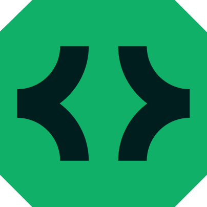
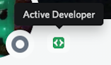

    
     

    Бот для получения значка активного разработчика в Discord

    
    
    

---

# 🕵️ Что это такое?

Недавно в Дискорд был добавлен новый значок. Его целью является поддержка всех активных разработчиков, однако сейчас его может получить любой пользователь.

    

Значок активного разработчика доступен разработчикам у которых есть минимум 1 активное приложение (или бот). Чтобы приложение считалось активным, через него должна быть выполнена глобальная команда.  

Бот на этой странице создан для того, чтобы упростить получение значка.

# 📝 Требования
- Python 3.8 и выше
- Request: https://pypi.org/project/requests/
- Discrod.py: https://pypi.org/project/discord.py/
- Свой сервер Discord

# ✅ Инструкции к использованию
Если у вас уже есть приложение в Discord, которое использует глобальные команды в течение текущего месяца, то просто перейдите в https://discord.com/developers/active-developer. Заполните форму и получите свой значок. Если формы нет, то либо ваше приложение не использовало глобальные команды, либо вам нужно подождать до 24 часов с момента их последнего использования.
1) Откройте ссылку https://discord.com/developers/applications. Создайте новое приложение с любым названием. Перейдите во вкладку "Bot" (бот) и нажмите на кнопку "Add bot" (добавить бота). Далее скопируйте token и сохраните его в любом удобном месте.
2) Создайте новый Дискорд сервер, перейдите в его найстройки и активируйте коммьюнити сервер (Community Server).
3) Загрузите репозиторий себе на ПК командой `git clone` или в виде архива при помощи ссылки: https://github.com/oqo0/discord-badge/archive/refs/heads/main.zip. Распакуйте архив.
4) Запустите `main.py` при помощи версии python 3.8 и выше.
5) В открывшееся окно вставьте токен вашего бота, который вы копировали перед этим, и нажмите Enter.
6) Как только бот залогинился перейдите по полученной ссылке и пригласите бота на сервер, который вы только что создали.
7) Зайдите на свой сервер в Дискорде и введите команду `/getbadge` в любом канале.
8) Откройте https://discord.com/developers/active-developer и заберите свой значок. (Возможность забрать значок должна появиться в течение 24 часов).